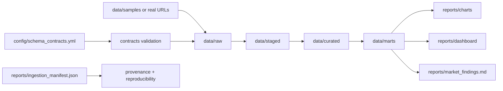

# Architecture

## Orchestration
- `make all` runs the full pipeline in deterministic order.
- `make ingest-real` and `make ingest-hybrid` support live-source workflows.

## Data Quality and Provenance
- Schema contracts are enforced at ingestion.
- Ingestion manifest records source refs, checksums, and row counts.
- QA validates artifacts across all milestones.
